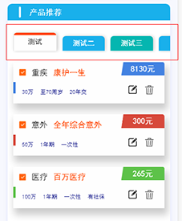

# tab 锚点滚动组件

> #### 目前业务中用到的组件功能
>
> #### 市面上有哪些类似功能的组件
>
> #### segment 组件功能描述及其 API

### 正文

1.目前项目中所用 到的组件功能

eg1：泰康在线保单检视计划书 segment 功能

> a）说明：list-button 个数不固定，超出屏幕宽度后，可以左右滑动，且索引奇数和偶数的背景色不相
>
> 同，点击后 button 的样式改变。content-box 内的列表随着显示或者隐藏。

> b）传入参数：
>
> button 个数：默认第一个为选中状态，如果只有一个，隐藏 list-button
>
> button 样式 class：自定义
>
> button 点击后状态的 class：自定义
>
> content-box 列表内容的显示/隐藏：自定义

eg2：泰康在线官网产品的 segment 功能

> a）说明：list-button 个数固定 3 个，平分显示在一屏内，点击后切换 list-botton 样式，并且 content-box 随着 list 的 button 的切换显示不同的内容

2.市面上所应用及同类竞品的选项卡功能：

eg1：众安 App

> a)说明：list-button 个数固定 5 个，每个按钮宽度相同，点击后切换 list-button 样式，并且 content-box 随着 list 的 button 的切换显示不同的内容

> b）content-box 内容可以左右滑动切换

eg2：京东快报

> a）标题栏内的 button 的个数超出一屏宽度，可以左右滑动，点击第 n 个 button 时，标题栏整体会往前移动一个 button 的宽度。

> b）带下拉按钮，点击后，显示下拉列表弹窗，同步 button 列表的所有 button， 点击弹窗内不同的 button，同步标题栏内的 button 事件，下拉列表弹窗消失，content-box 内对应的列表显示。

> c）content-box 里面对应的列表会从屏幕右侧滑入。

3.tk-segment 描述：结合项目中常用的功能及市面上常见的效果自定义 segment

> a）组件说明：
>
> <1> 结构：主体 segment 容器 分为 button-box （list-button 及 select-button）和 content-box 两部分
>
> <2> 自定义样式：button 的默认样式 及 选中状态样式 如果用户自己定义，通过最外层父级的 class 来修改 list-button 样式
>
> <3> 自定义 class：
>
> ① btnBoxParentClass：list-button 最外层父容器的类名

> b）要实现的功能：
>
> <1> 点击每一个 list-button，content-box 内容切换
>
> <2> button-box 的 宽度超过一屏，可以左右滑动
>
> <3> 点击 “select-button”，弹窗显示，弹窗内容可自定义。
>
> <4> "select-button" 通过参数判断 显示/隐藏

4.API

|     |        参数        |                    说明                    |   类型   |          默认值           |                                                                                                                 备注 |
| :-- | :----------------: | :----------------------------------------: | :------: | :-----------------------: | -------------------------------------------------------------------------------------------------------------------: |
| 1.  | btnBoxParentClass  | 绑定 list-button 最外层父元素的 class 类名 |   str    | "default-segment-parent"  |                                                                                                   className 可自定义 |
| 2.  |    checkBtnNum     |         点击第几个 button 开始移动         |  Number  |             2             |                                                                    点击第 2+1 个 list-button button 列表整体向左移动 |
| 3.  |      btnList       |            list-button 的 text             |  Array   |         "btnList"         |                                                                                                                 必传 |
| 4.  |  clickBtnCallback  |        选中 list-button 的回调函数         | Function |  clickBtnCallback(msg){}  |                                                             页面组件标签中绑定此方法,msg 为点击的 list-button 的索引 |
| 5.  |   selectBtnFlag    |         判断 select-button 的显隐          | Boolean  |           false           |                                                                                               true:显示， false:隐藏 |
| 6.  | selectMarkCallback |          点击 select-button 回调           | Function | selectMarkCallback(msg){} | 页面组件标签中绑定此方法,msg 为 true， 赋值给 selectBtnFlag 显示筛选内容，如果不需要显示 “选择按钮” 则不用绑定此方法 |
| 7.  |  tkSegmentContent  |       content-box 内容 slot 的 name        |  String  |    "tkSegmentContent"     |                                                                                    定义于 segment 内容标签内，不可变 |
| 8.  |  tkSegmentSelect   |        选择框内容插槽 slot 的 name         |  String  |      tkSegmentSelect      |                                                                                           定义选择内容标签内，不可变 |
